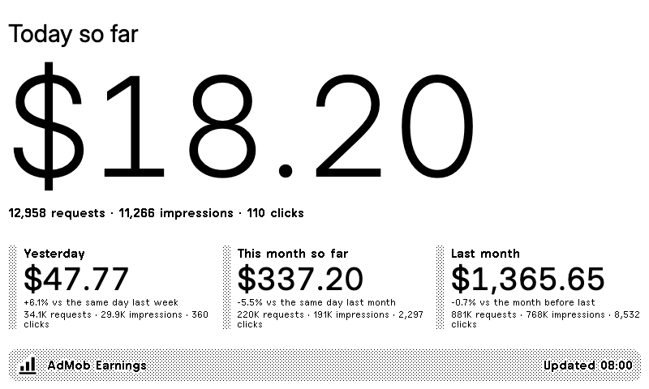

# AdMob Earnings

A TRMNL recipe that shows Google AdMob estimated earnings at a glance, in the account's reporting currency:

| Tile | Figure | Comparison line |
| --- | --- | --- |
| **Today so far** (primary, large) | Earnings so far today (partial, estimated) | None |
| Yesterday | Yesterday's earnings | "{change} vs the same day last week" |
| This month so far | Month to date, including today | "{change} vs the same day last month" |
| Last month | The previous full month | "{change} vs the month before last" |

Every tile also shows its ad requests, impressions and clicks in small type; AdMob has no page-view metric. The change is a percentage, an amount or both, set in the plugin. The title bar shows when the figures were fetched ("Updated 08:00") instead of dates.

Installers sign in with Google and pick their AdMob account from a list. There is no API key to paste and no hosted service: TRMNL polls the AdMob API with the installer's OAuth token and a transform turns the report into the four tiles.



**Status:** built and tested offline. The Google Cloud project, consent screen (in production, non-sensitive scope, no verification needed) and OAuth client exist, and the recipe is imported on TRMNL as a private plugin. Next: connect Google in TRMNL and confirm the first refresh. See the plan in [docs/admob-earnings.md](../../docs/admob-earnings.md).

## Develop

```sh
pnpm dev:admob            # preview at http://127.0.0.1:4567 with every recorded response
pnpm review:admob         # 4 cases × 24 screens, contact sheets in dist/review/responsive
pnpm review:admob:check   # every case: dark mode, statuses, no data, setup
pnpm screenshots:admob    # regenerate docs/screenshots from docs/screenshots.json
pnpm build:admob          # dist/admob-earnings.zip for TRMNL's importer
```

`pnpm check`, `pnpm test` and `pnpm build` at the root cover this app too. Nothing in local development calls Google.

## How it works

- **Request** (`src/settings.yml`): one `POST` to `accounts/{publisher_id}/networkReport:generate` with `Authorization: Bearer {{ oauth_access_token }}`. The Liquid body asks for daily `ESTIMATED_EARNINGS` over the last 93 days, ending one day after the UTC date, which always covers this month and the two full months before it in any time zone.
- **Account picker**: `publisher_id` is an `xhrSelect` field whose `remote:` block calls `GET /v1/accounts` with the installer's token on TRMNL's servers, so the installer chooses from their own accounts.
- **Transform** (`src/transform.js`): parses the header, row and footer elements; finds "today" in the account's reporting time zone (falling back to the TRMNL user's offset); sums the periods; formats money with currency symbols and whole-unit currencies such as JPY; writes the comparison text for the chosen style; and picks one value size per view from the widest amount, so tiles match and never overflow. Errors become a `status` of `setup`, `auth`, `access`, `no_data` or `error`, and every view explains what to do.
- **Views** (`src/*.liquid`): framework classes only. One large primary figure (today so far) and three equal secondary tiles. Full puts the primary across the top with the three tiles in a row beneath it (stacked in portrait); half horizontal places the tiles in a row beside or below the primary; half vertical and the quadrant stack or row them beneath, the quadrant showing amounts only. Amounts in each group share one size, chosen by the transform from measured tile widths. Dark appearance follows Daily Bread's convention.

## TRMNL and GitHub Sync

The live plugin is TRMNL private plugin 499993. TRMNL's GitHub Sync commits every Save made in TRMNL to `apps/admob-earnings/src/` as `trmnl-sync[bot]`, so pull before editing locally.

- **TRMNL → GitHub** is automatic. The sync writes `settings.yml` in TRMNL's own format, including `id`, the polling URL, headers and body, and drops YAML comments, so keep explanations here rather than in `settings.yml`. The OAuth client ID and secret and your chosen publisher ID are never written.
- **GitHub → TRMNL**: use TRMNL's "Import latest", or `TRMNL_PLUGIN_ID=499993 pnpm --filter @trmnl/admob-earnings upload`.
- **Never push a copy fetched with `trmnlp pull`.** That API archive writes the encrypted `polling_body` and `polling_headers` as blanks, and pushing blanks wipes the live AdMob request (tested 9 October 2026).

Notes that used to live as comments in `settings.yml`:

- One polling URL, so TRMNL hands the transform the report array as `data`. The publisher ID comes from the account picker, filled by AdMob's accounts list.
- The body asks for 93 days, which always covers this month and the two full months before it. TRMNL renders Liquid in UTC, so the end date runs one day ahead for time zones east of UTC; AdMob accepts it and has no row for a date that has not started.
- AdMob has no wildcard for "the signed-in account" (`accounts/-` returns 400), so the picker is needed. It is optional because its list only loads after Google is connected, and TRMNL will not save the plugin, including its OAuth client, while a required field is empty.
- The Google OAuth client ID and secret are entered in TRMNL and never committed.

## Fixtures

`fixtures/` holds responses in the documented AdMob shape. The report fixtures are synthetic and deterministic (`pnpm --filter @trmnl/admob-earnings fixtures` rewrites them); the error fixtures copy Google's error bodies. Each fixture's entry in `plugin.config.json` records when it was polled, and previews render at that moment. A test checks that every report fixture's date range matches what the recipe would request at that time.

| Fixture | Covers |
| --- | --- |
| `usd` | A typical account mid-month |
| `jpy` | Seven- and eight-digit yen totals, Tokyo ahead of UTC |
| `eur-month-start` | The 1st of the month, a 30-day previous month, a missing day |
| `zar-early` | Just after midnight, before today's first row |
| `empty` | No earnings in three months |
| `unauthenticated`, `permission` | Expired sign-in and an inaccessible account |

## Going live

Everything below needs credentials, so it has not been done yet.

1. **Google Cloud**: create a project, enable the AdMob API, configure the OAuth consent screen (external) and create a web OAuth client. Add TRMNL's redirect URL and, for local testing, `http://localhost:4567/oauth/callback`. Add the `admob.report` scope and set the publishing status to **In production**: in Testing mode Google expires every sign-in after seven days.
2. **Record a real response**: run `trmnlp serve` here with `TRMNL_OAUTH_CLIENT_ID` and `TRMNL_OAUTH_CLIENT_SECRET` set to sign in locally, or use any token with the `admob.report` scope:

   ```sh
   ADMOB_ACCESS_TOKEN=… pnpm --filter @trmnl/admob-earnings fetch                     # lists your accounts
   ADMOB_ACCESS_TOKEN=… pnpm --filter @trmnl/admob-earnings fetch --publisher pub-… --scale 0.37
   ```

   The response is written to `.cache/` (ignored). `--scale` hides real revenue before a recording becomes a committed fixture.
3. **TRMNL**: import `dist/admob-earnings.zip`, then in the plugin's settings confirm the OAuth fields (the ZIP carries the provider URLs, scope and `access_type=offline`), paste the client ID and secret, connect Google, choose the account, and use **Force Refresh**.
4. **Confirm the first refresh** against the researched open questions in the plan, compare figures with the AdMob console for a few days across a month boundary, then publish the recipe. Google verification is optional; the plan explains the warning screen and 100-user cap.

Never commit the client ID, secret, tokens or TRMNL plugin IDs. `checkPlugin` rejects `oauth_client_*` keys in `settings.yml`.
