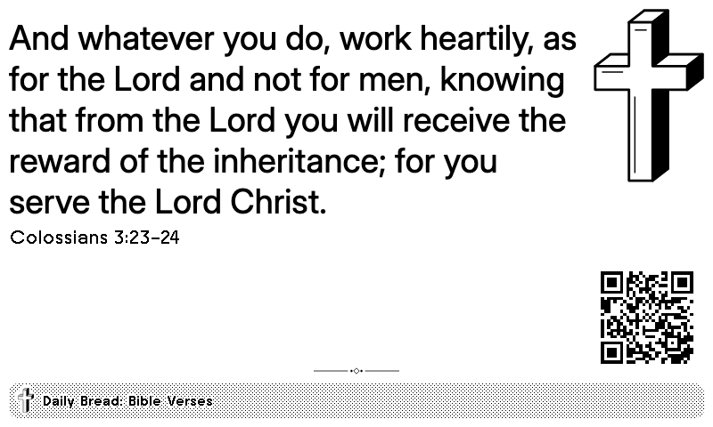
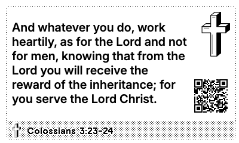
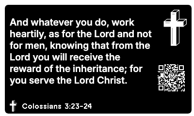

# Daily Bread: Bible Verses

Daily Bible verses for your TRMNL. One complete passage to carry into your day, with a distinctive cross and a collection chosen for everyday Christian life.

Choose English, French or Spanish, enjoy a mix of nine practical themes, and scan the optional QR code to read the full chapter. Daily Bread includes the collection; no Bible API key or separate Bible subscription is needed.

The [listing icon](assets/icon.png) and its [SVG source](assets/icon.svg), publication titles, descriptions, localized overview copy and search/share metadata are ready in the [listing copy](docs/listing.md). The [collection review](docs/content-review.md) records source verification and the completed editorial revision.



## MVP

- **108 passages**, with 12 in each of nine practical themes: Family & home, Relationships, Work & purpose, Money & generosity, Decisions & direction, Worry & rest, Hard times & loss, Joy & gratitude, and Faith & prayer.
- **Every theme** by default, interleaved so successive intervals move between themes. Users can choose one or several themes with [TRMNL’s native multi-select](https://help.trmnl.com/en/articles/10513740-custom-plugin-form-builder); leaving it empty keeps the mix.
- **One translation per language**: English (default) uses the updated, LORD edition of the [World English Bible](https://worldenglish.bible/) (`engwebp`); French uses [Louis Segond 1910](https://ebible.org/bible/details.php?id=fraLSG); Spanish uses [Reina Valera 1909](https://ebible.org/bible/details.php?id=spaRV1909). All three sources are public domain. Each language includes the same 108 curated selections, with localized references, themes and attribution.
- **Daily** by default; every 12 hours, every 6 hours, or hourly are also available.
- Full, half horizontal, half vertical, and quadrant layouts. Complete passage text and reference in every layout. The full view wraps Scripture around a larger dimensional cross at the top right. Wide half and quadrant views keep the cross at the top right; left/right halves center it above the verse, as do top/bottom halves in portrait. The cross remains visible with QR enabled or disabled. Text continues beneath the cross in wide halves and quadrants. In full, half horizontal and quadrant views, the chapter QR code sits at the bottom right above the reference bar; in wide halves and quadrants, Scripture wraps around it as it does around the cross, and a reference that would meet it moves into the bar. Left/right halves put it at the top right beside the centered cross. Full views use a 128px QR footprint, centered halves 80–96px, and wide halves and quadrants 64px with a smaller quiet zone, all scaled by the framework. OG cross sizes are restrained, while TRMNL X uses larger artwork.
- Light (default) or Dark appearance. Dark full screens use the framework's screen dark mode; dark mashup layouts use framework `inverse` tokens on Daily Bread's own content, so neighbouring plugins keep their appearance. The cross and ornament artwork swap ink and paper to stay dimensional on black; the chapter QR code keeps a white tile for reliable scanning. Leave the plugin's own dark mode setting off, since it would invert a Dark selection back to light.
- No hosted backend, Bible API subscription, authentication, or API key.

Passage text dynamically fits the measured reading area using [TRMNL Fit Value](https://trmnl.com/framework/docs/3.4/fit_value). The reference sits under the passage in larger type, with the plugin name in the bottom bar. When the reference would leave the passage smaller than 1.25 times its own size, it moves into the bar instead. Scripture is never truncated. Three small, scoped CSS rules in shared.liquid enable the requested full, wide-half and quadrant wrap around the cross and bottom-right QR; other styling uses the framework.

## Install on TRMNL

1. From the monorepo root, run `pnpm install` and `pnpm build`.
2. Open **Plugins → Private Plugin** in TRMNL and choose **Import new**.
3. Select `apps/bible-verses/dist/daily-bread.zip`.
4. Choose **Language**, **Themes**, **New passage**, **Chapter QR code** and **Appearance** in the imported plugin's settings.
5. Confirm your TRMNL account timezone, add the plugin to your preferred playlist or mashup, and refresh.

To upload from the command line instead, run `pnpm upload` from the monorepo root after `bundle exec trmnlp login`. It creates a new private plugin. To update an existing one, set its ID: `TRMNL_PLUGIN_ID=<id> pnpm upload`. Keep that ID out of the repository.

TRMNL's Developer edition or BYOD license enables private plugins. See [the official prerequisites](https://help.trmnl.com/en/articles/9510536-private-plugins) and [import instructions](https://help.trmnl.com/en/articles/10542599-importing-and-exporting-private-plugins).

The build exports a flat ZIP with `settings.yml`, four `.liquid` files, and `transform.js`. TRMNL rejects a `settings.yml` or `transform.js` over about 100 KB, so the build keeps English and as many translations as fit in `static_data` (currently French) and bundles the rest in the transform as `SCRIPTURE` (currently Spanish); the transform merges them and returns only the selected language. The build fails before export if either file would exceed the limit. It prepends `shared.liquid` to each view. Import the generated ZIP; the source `src/settings.yml` is a development input and does not contain the bundled data by itself. In the markup editor, confirm the imported JavaScript appears in the default **Transform** tab; if your importer omits it, copy `src/transform.js` there before relying on automatic rotation. It uses `transform(input)`, not the serverless `run(input)` interface.

## Timing

Rotation uses the current render timestamp and the user's TRMNL UTC offset, [as documented by TRMNL](https://help.trmnl.com/en/articles/10693981-advanced-liquid). It does not count refreshes or choose a fresh random verse. TRMNL [skips unchanged merge variables](https://help.trmnl.com/en/articles/9510536-private-plugins), so the bundled default-runtime transform adds a `rotation_slot` marker that changes at the selected local boundary. The marker is independent of the static Scripture data and ensures the transformed payload changes when a new image is needed.

| Setting | Local boundaries |
| --- | --- |
| Every day | Midnight |
| Every 12 hours | Midnight and noon |
| Every 6 hours | 00:00, 06:00, 12:00, 18:00 |
| Every hour | The start of each hour |

A passage stays stable throughout its slot and changes on the first successful plugin render after the next boundary. The recipe's refresh interval defaults to 60 minutes, supporting every offered rotation. Device wake time, playlist order, sleep mode, connectivity, and TRMNL caching can delay when a new image appears. The custom rotation field does not change the plugin refresh or device wake interval. Keep plugin refresh at 60 minutes or faster for hourly rotation; daily users can choose a slower refresh if they accept later delivery after midnight.

The selection is deterministic: users with the same accepted themes, interval, and local slot see the same passage. The mixed cycle repeats after 108 slots; a single-theme cycle repeats after 12, and two themes after 24. Each selected theme receives an equal share of the current cycle, without repeating passages. Selection order and duplicate values do not affect rotation. Changing themes or interval immediately selects that setting's current slot. Skipped refreshes advance directly to the current passage; there is no backlog. TRMNL supplies the current timezone offset, including daylight-saving changes; an hourly slot may repeat or be skipped when the local clock changes.

## Curation and text provenance

[`content/selection.json`](content/selection.json) is the editorial list: each passage has one primary theme, internal tags and a context note. Tags and notes remain in the workspace and are excluded from the recipe. See [the curation guide](docs/curation.md) for theme boundaries and the review process. [`content/verses.json`](content/verses.json), [`content/verses.fr.json`](content/verses.fr.json) and [`content/verses.es.json`](content/verses.es.json) hold the verbatim publisher text, reference, theme, and chapter URL for each passage, plus each imported archive's SHA-256. Whitespace is normalized; footnotes, navigation and non-Scripture headings are excluded. Quotation marks and capitalization remain as published. Scripture and attribution opt out of browser translation so the preview preserves the source wording.

[`content/selection.fr.json`](content/selection.fr.json) explicitly maps the seven Psalm selections whose verse numbering differs in Louis Segond (including Psaumes 55:23 for English Psalm 55:22). Stable passage IDs keep the same selection in each language; displayed references and source links use that translation's actual verse numbers. [`content/locales.json`](content/locales.json) defines the translations, book names, theme names and display labels. Normal builds combine the three local collections without fetching Scripture. The [2 October source and language review](docs/content-review.md) checked all 324 passage records and reviewed the French and Spanish wording, references and interface copy. Native-speaker feedback is welcome; these older French and Spanish editions retain their original language and spelling.

Selections cover comfort, perseverance, practical conduct, thanksgiving, prayer, and life together. Prefer complete thoughts and enough surrounding verses to preserve meaning. Read each passage in its chapter before adding it. A theme describes its everyday relevance; it is not a promise that a verse guarantees an individual outcome. No generated devotionals or paraphrases are mixed into Scripture.

To explicitly update the text from the publisher:

```sh
curl -L https://ebible.org/engwebp/engwebp_html.zip -o /tmp/engwebp_html.zip
cd apps/bible-verses
python3 scripts/import-verses.py /tmp/engwebp_html.zip
```

For French and Spanish, download each publisher archive and explicitly import it:

```sh
curl -fL https://ebible.org/fraLSG/fraLSG_html.zip -o /tmp/fraLSG_html.zip
curl -fL https://ebible.org/spaRV1909/spaRV1909_html.zip -o /tmp/spaRV1909_html.zip
python3 apps/bible-verses/scripts/import-verses.py /tmp/fraLSG_html.zip fr
python3 apps/bible-verses/scripts/import-verses.py /tmp/spaRV1909_html.zip es
```

Run these commands from the monorepo root. Python 3 is required for the importer and its regression test. The importer rejects an archive in the wrong language. Review the generated text against the chapter links, including the French numbering overrides and word boundaries around removed footnotes, before rebuilding.

Review the content diff, run the checks from the monorepo root, and rebuild the ZIP. Normal builds never fetch or change Scripture. The importer interleaves every selected passage and supports different theme sizes. It rejects duplicate references, empty themes, missing editorial notes or tags, and an archive in the wrong language. Update coverage tests when growing the collection. Keep one translation per language, with independent source attribution and layout review.

## Local development

From the root: `pnpm dev`. The preview uses a collapsed checkbox picker for themes, with none selected (every theme) initially. Its filtering matches the exported recipe; TRMNL renders its own native multi-select in account settings. The preview's UTC offset initially uses UTC+2; adjust it to simulate another user. This is a preview default, not a hardcoded timezone in the exported recipe. Use the Device and Orientation controls to review the original 1-bit display, 2-bit profile, and high-density TRMNL X in landscape or portrait. Previews fit the available width and height; choose Actual pixels for full-resolution inspection. Shared tools reload automatically; refresh the preview after template or content edits.

`pnpm test` verifies rotation boundaries, timezone offsets, repeat-free cycles, multiple-theme filtering, blank and legacy preferences, consistent complete text across every view, missing-data recovery, content provenance, and ZIP import round trips. The [appearance browser review](docs/appearance-layout-checks.json) checks the final cross, wrapping, QR placement and full-width bar using the longest passage in every theme and the shortest passage in each language, across all four layouts, all three profiles, both orientations and both QR settings. The earlier [theme/content review](docs/theme-layout-checks.json) records the previous layout revision. Long passages were checked in all three languages with QR display enabled and disabled. Screenshots below show the longest English passage on the original display. These are local framework previews. The release was also checked in the TRMNL account: all four live layouts, French and Spanish, multi-theme filtering, hourly rotation and QR on/off rendered correctly. Physical-device appearance has not been inspected.

| Half horizontal | Half vertical | Quadrant |
| --- | --- | --- |
|  |  |  |

With **Appearance** set to Dark:


| Half horizontal | Half vertical | Quadrant |
| --- | --- | --- |
|  |  |  |

## Sharing

Submitted for public TRMNL recipe review on 2 October 2026. The existing account plugin received the current collection, all four layouts, the 512px icon, the public Overview and generated OG/X marketplace previews. The account confirmed “Submitted! We’ll be in touch soon.” Public availability awaits human approval. The [release checks](docs/release-layout-checks.json) record 36 passing tests, 144 current responsive captures and the live account checks; physical-device appearance remains unverified. The [publication copy](docs/listing.md) records the submission and advisory AI review findings.
