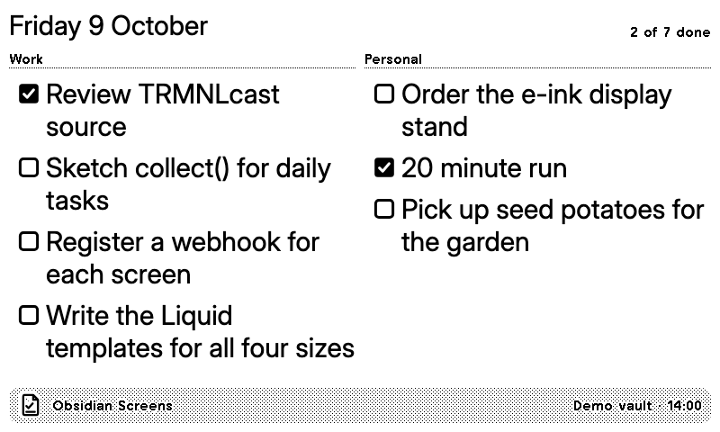

# Obsidian Screens

Your Obsidian vault on a TRMNL. Two halves live here:

- **TRMNL Screens**, an Obsidian plugin (`obsidian-plugin/`) that reads the vault on your own computer or phone and pushes one screen's data to a TRMNL webhook. TRMNL cannot reach a vault, so Obsidian pushes.
- **Obsidian Screens**, a TRMNL webhook recipe (`src/`) with the Liquid views for every screen. Install it once per screen; each install has its own webhook URL and its own 12-an-hour push budget.

| Screen | Shows | Source |
| --- | --- | --- |
| Today's daily note tasks | Checkboxes in today's daily note, grouped by heading, with done/total | Daily Notes or Periodic Notes settings |
| Due and overdue tasks | Open tasks with a due date across the vault: overdue, today, then the days ahead | Tasks plugin `📅 2026-10-09` or Dataview `[due:: 2026-10-09]`, `(due:: …)`, `due:: …` |
| Dataview query | The rows of a `TABLE` or `LIST` query | Dataview's API (needs the Dataview plugin) |
| Resurfaced note | A note you have not touched in a while, with its opening paragraphs; a new pick each day, weighted towards older notes | Note modified times |
| Writing stats | Words written today, the daily streak and a bar for each of the last 14 days | The vault's word count, measured each run |
| Pinned note | One note you choose, such as a weekly plan, as headings, `Label: text` pairs, list items and checkboxes | Any note |

Every view comes in full, half horizontal, half vertical and quadrant, in landscape and portrait, on TRMNL OG and X.



**Status:** built and tested locally against the demo vault, not yet run against a real TRMNL account. See [docs/obsidian-screens.md](../../docs/obsidian-screens.md) for the plan, decisions and what is left.

## Try it with the demo vault

`demo-vault/` is a small vault with a week of daily notes, four projects with due dates in both formats, older notes to resurface and a pinned `Focus.md`. Its fixtures are generated from it, so it doubles as the test data.

```sh
pnpm --filter @trmnl/obsidian demo:age      # give the notes their intended ages (git does not keep them)
pnpm --filter @trmnl/obsidian plugin:dev    # build the plugin into demo-vault/.obsidian/plugins and rebuild on change
```

Then in Obsidian: **Open folder as vault** → `apps/obsidian/demo-vault`, trust the vault when asked so community plugins can run, and turn on **TRMNL Screens** under Community plugins. For the Dataview screen, also install Dataview from the community plugin browser. **Preview** on any screen in the plugin's settings (or the command "Preview a screen's data…") shows exactly what would be pushed, with no TRMNL account needed.

To push for real:

1. `pnpm build` writes `dist/obsidian-screens.zip`. On TRMNL, **Plugins → Private Plugin → Import new** and choose it. Do this once per screen you want.
2. Copy that plugin's webhook URL from its settings on TRMNL.
3. In Obsidian's TRMNL Screens settings, turn the screen on and, under **Webhook URL**, create a secret holding that URL. Secrets live in Obsidian's secret storage, never in the vault.
4. **Push now** sends it; after that the plugin pushes on its own.

## Develop

```sh
pnpm dev:obsidian            # recipe preview with every fixture at http://127.0.0.1:4567
pnpm review:obsidian         # 10 cases × 24 screens, contact sheets in dist/review/responsive
pnpm review:obsidian:check   # every case, including empty and error states
pnpm --filter @trmnl/obsidian fixtures   # regenerate fixtures/ after changing a collector or the demo vault
pnpm build:obsidian          # dist/obsidian-screens.zip and dist/obsidian-plugin/{main.js,manifest.json}
```

`pnpm check`, `pnpm test` and `pnpm build` at the root cover this app. Nothing in local development calls TRMNL.

To update an installed copy on TRMNL, run `TRMNL_PLUGIN_ID=<id> pnpm --filter @trmnl/obsidian upload` for each copy. Pushed data survives an upload, but the name resets to "Obsidian Screens" from `settings.yml`, so rename each copy afterwards (the live copies are listed in [docs/obsidian-screens.md](../../docs/obsidian-screens.md)).

## How it works

- **Collectors** (`obsidian-plugin/src/screens/`): one module per screen, each a pure function of a vault index, the current moment and the screen's options, so the same code runs in Obsidian, in tests and in the fixture generator. Text arrives as plain text: links read as their visible text, Tasks signifiers and inline fields are removed, and so are emoji, which e-ink cannot draw.
- **Pushes** (`obsidian-plugin/src/main.js`): edits are collected and pushed once the vault has been quiet for a minute, only to screens they can affect; a check every 15 minutes catches date changes. A screen whose data has not changed is not pushed again for three hours. Each webhook gets 12 pushes in any sliding hour (30 with TRMNL+); past that a push waits for the next slot. Payloads are trimmed to 5 KB (10 KB) by dropping whole items, never by cutting text mid-word. The status bar shows the last push and the pushes left this hour.
- **Recipe** (`src/`): `screen` in the pushed data picks the layout. Lists flow into columns with TRMNL's overflow engine and size their type by how many items there are. Framework classes only; checkboxes and the icon are inline SVG.

TRMNL framework 3.4's overflow engine under-trims long lists on TRMNL X (it compares the scaled screen's bounding boxes with unscaled scroll heights), so each view also caps its list at what fits there. Group headings use plain `label` classes because the engine measures clones of them without size modifiers.

## Fixtures

`fixtures/*.json` are the merge variables each screen pushes, generated by `scripts/generate-fixtures.js` from the demo vault at 14:00 UTC on 9 October 2026, plus in-memory vaults for edge cases: long lists, nothing due, no daily note, all done, a missing pinned note, no Dataview, a first day of writing stats, and the empty `waiting` state before the first push. A test fails if a committed fixture no longer matches what the collectors produce.
